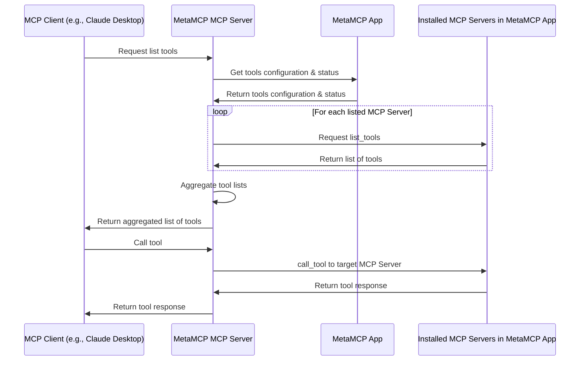

# MetaMCP (Unified middleware MCP to manage all your MCPs)

[](https://discord.gg/mNsyat7mFX)

MetaMCP is the unified middleware MCP to manage all your MCPs. It uses a GUI fullstack app (this repo) and a local MCP proxy to achieve this. (see our latest npm repo [mcp-server-metamcp](https://github.com/metatool-ai/mcp-server-metamcp))

A few feature highlights:

- GUI app to manage multiple MCP server integrations all together.
- Support ANY MCP clients (e.g., Claude Desktop, Cursor, etc.) because MetaMCP is a MCP server.
- Support prompts, resources, tools under MCP.
- Support multi-workspace: e.g., activate a workspace of DB1 or switch to DB2 in another workspace, preventing polluting context of DB1 to your MCP Client.
- Tool level toggle on/off

The app is also self hostable, free and open source. There is also a cloud version. You can try how this app works using cloud version but I actually encourage you to self host if you are familiar with docker: it will provide unlimited access with lower latency, full private operations on your end.

Check out demo videos at https://metamcp.com/. Here is an overview screenshot.


## Verified Platform

- [x] Windows (after MCP official typescript SDK 1.8.0, which we updated accordingly, it works) https://github.com/metatool-ai/metatool-app/issues/15
- [x] Mac
- [x] Linux

## Installation

To get started with this self hostable version of MetaMCP App, the eastiest way is to clone the repository and use Docker Compose to run it.

```bash
git clone https://github.com/metatool-ai/metatool-app.git
cd metatool-app
cp example.env .env
docker compose up --build -d
```

Then open http://localhost:12005 in your browser to open MetaMCP App.

It is recommended to have npx (node.js based mcp) and uvx (python based mcp) installed globally.
To install uv check: https://docs.astral.sh/uv/getting-started/installation/

### Default Remote Mode SSE endpoint for MetaMCP

The recommended way to connect to MetaMCP is via the SSE endpoint:

```
http://localhost:12007/sse with Authorization: Bearer <your-api-key>
```

Alternatively, if you cannot set headers, you can use this URL-based endpoint:

```
http://localhost:12007/api-key/<your-api-key>/sse
```

You can get the API key from the MetaMCP App's API Keys page.

### For Local Access

You can still use these methods even if your workspace is in Default Remote Mode.

#### Claude Desktop Configuration

For Claude Desktop, the config json should look like this:

```json
{
  "mcpServers": {
    "MetaMCP": {
      "command": "npx",
      "args": ["-y", "@metamcp/mcp-server-metamcp@latest"],
      "env": {
        "METAMCP_API_KEY": "<your api key>",
        "METAMCP_API_BASE_URL": "http://localhost:12005"
      }
    }
  }
}
```

#### Cursor Configuration

For Cursor, env vars aren't easy to get typed in so you may use args instead:

```bash
npx -y @metamcp/mcp-server-metamcp@latest --metamcp-api-key <your-api-key> --metamcp-api-base-url http://localhost:12005
```

#### Windows Configuration

For Windows, you can use the following command for Cursor:

```bash
cmd /c npx -y @metamcp/mcp-server-metamcp@latest --metamcp-api-key <your-api-key> --metamcp-api-base-url http://localhost:12005
```

Or configure it using json:

```json
{
  "mcpServers": {
    "MetaMCP": {
      "command": "cmd",
      "args": [
        "/c",
        "npx",
        "-y",
        "@metamcp/mcp-server-metamcp@latest"
      ],
      "env": {
        "METAMCP_API_KEY": "<your api key>",
        "METAMCP_API_BASE_URL": "http://localhost:12005"
      }
    }
  }
}
```

#### Standalone SSE Server

You can also use the following command to start a standalone SSE server:

```bash
mcp-server-metamcp --metamcp-api-key <your-api-key> --transport sse --port 12006
```

Then use following json configuration:

```json
{
  "mcpServers": {
    "MetaMCP": {
      "url": "http://localhost:12006"
    }
  }
}
```

#### Smithery Windows Configuration

You can also use Smithery to run MCPs in docker on cloud for max compatibility:

```bash
smithery run @metatool-ai/mcp-server-metamcp --config '{"metamcpApiKey":"<your api key>"}'
```

Or configure it in your Claude Desktop configuration file:

```json
{
  "mcpServers": {
    "MetaMCP": {
      "command": "smithery",
      "args": [
        "run",
        "@metatool-ai/mcp-server-metamcp",
        "--config",
        "{\"metamcpApiKey\":\"<your api key>\"}"
      ]
    }
  }
}
```

You can get the API key from the MetaMCP App's API Keys page.

## Architecture Overview

Note that prompts and resources are also covered similar to tools.



## Basic HTTP Authentication (Optional)

MetaMCP App includes optional basic HTTP authentication to protect your self-hosted instance. To enable it:

1. Set the following environment variables in your `.env` file:
   ```bash
   BASIC_AUTH_USERNAME=your-username
   BASIC_AUTH_PASSWORD=your-secure-password
   ```

2. Restart your application:
   ```bash
   docker compose down
   docker compose up --build -d
   ```

When enabled, all routes will require basic HTTP authentication except for:
- Static assets (`/_next/static`, `/_next/image`, `/favicon.ico`)
- API routes (`/api/*`) - these use their own API key authentication
- Other public paths (you can customize this in `middleware.ts`)

If you don't set these environment variables, the authentication will be disabled and the app will work as before.

**Security Note**: Make sure to use a strong password and consider using HTTPS in production environments.


## License

GNU AGPL v3

## Credits
- Used some oauth codes in https://github.com/modelcontextprotocol/inspector
- (Deprecated) Demo video uses MCP Client [5ire](https://5ire.app/)
