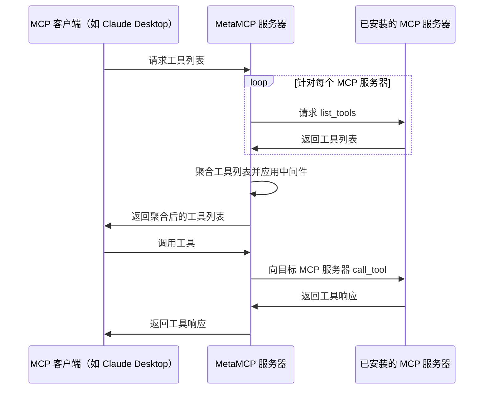

# 🚀 MetaMCP（聚合MCP服务器和应用的中间件，托管并输出统一的 MCP 服务器）

<div align="center">

<p align="center">
  <a href="https://discord.gg/mNsyat7mFX" style="text-decoration: none;">
    
  </a>
  <a href="https://opensource.org/licenses/MIT" style="text-decoration: none;">
    
  </a>
  <a href="https://github.com/metatool-ai/metamcp/pkgs/container/metamcp" style="text-decoration: none;">
    
  </a>
</p>

</div>

**MetaMCP** 是一个 MCP 代理，允许你动态聚合 MCP 服务器为统一的 MCP 服务器，并应用中间件。MetaMCP 本身也是一个 MCP 服务器，因此可以轻松接入**任何** MCP 客户端。


---

[English](./README.md) | 中文


## 📋 目录

- [🎯 使用场景](#-使用场景)
- [📖 核心概念](#-核心概念)
  - [🖥️ MCP 服务器](#️-mcp-服务器)
  - [🏷️ MetaMCP 命名空间](#️-metamcp-命名空间)
  - [🌐 MetaMCP 端点](#-metamcp-端点)
  - [⚙️ 中间件](#️-中间件)
  - [🔍 检查器](#-检查器)
- [🚀 快速开始](#-快速开始)
  - [🐳 使用 Docker Compose 运行（推荐）](#-使用-docker-compose-运行推荐)
  - [💻 本地开发](#-本地开发)
- [🔌 MCP 协议兼容性](#-mcp-协议兼容性)
- [🔗 连接到 MetaMCP](#-连接到-metamcp)
  - [📝 例如，通过 mcp.json 连接 Cursor](#-例如通过-mcpjson-连接-cursor)
  - [🖥️ 连接 Claude Desktop 和其他仅支持 STDIO 的客户端](#️-连接-claude-desktop-和其他仅支持-stdio-的客户端)
  - [🔧 API Key 认证故障排除](#-api-key-认证故障排除)
- [❄️ 冷启动问题与自定义 Dockerfile](#️-冷启动问题与自定义-dockerfile)
- [🔐 认证](#-认证)
- [🔗 OpenID Connect (OIDC) 提供商支持](#-openid-connect-oidc-提供商支持)
  - [🛠️ 配置](#️-配置)
  - [🏢 支持的提供商](#-支持的提供商)
  - [🔒 安全特性](#-安全特性)
  - [📱 使用方法](#-使用方法)
- [🌐 自定义部署和 Nginx 的 SSE 配置](#-自定义部署和-nginx-的-sse-配置)
- [🏗️ 架构](#️-架构)
  - [📊 时序图](#-时序图)
- [🗺️ 路线图](#️-路线图)
- [🌐 i18n](#-i18n)
- [🤝 贡献指南](#-贡献指南)
- [📄 许可证](#-许可证)
- [🙏 鸣谢](#-鸣谢)


## 🎯 使用场景
- 🏷️ **将 MCP 服务器分组到命名空间，作为 meta-MCP 托管，并分配公共端点**（SSE 或 Streamable HTTP），支持认证。一键切换端点的命名空间。
-  🎯 **在混合 MCP 服务器时只选择你需要的工具。** 可应用其他**可插拔中间件**，如可观测性、安全等（即将推出）。
-  🔍 **作为增强版 MCP 检查器**，支持保存服务器配置，并可在本地检查 MetaMCP 端点是否可用。
-  🔍 **作为 MCP 工具选择的 Elasticsearch**（即将推出）

开发者通常可以将 MetaMCP 作为**基础设施**，通过统一端点托管动态组合的 MCP 服务器，并在其上构建智能体。

快速演示视频：https://youtu.be/Cf6jVd2saAs


## 📖 核心概念

### 🖥️ **MCP 服务器**
MCP 服务器配置，告诉 MetaMCP 如何启动 MCP 服务器。

```json
"HackerNews": {
  "type": "STDIO",
  "command": "uvx",
  "args": ["mcp-hn"]
}
```

### 🏷️ **MetaMCP 命名空间**
- 将一个或多个 MCP 服务器分组到命名空间
- 支持在服务器或工具级别启用/禁用 MCP 服务器
- 可在命名空间级别应用中间件处理 MCP 请求和响应

### 🌐 **MetaMCP 端点**
- 创建端点并为其分配命名空间
- 命名空间内的多个 MCP 服务器将被聚合并作为 MetaMCP 端点输出
- 可选择认证级别和策略
- 通过 **SSE** 或 **Streamable HTTP** 传输协议以及 **OpenAPI** 端点对外提供服务，支持 [Open WebUI](https://github.com/open-webui/open-webui) 等客户端

### ⚙️ **中间件**
- 在命名空间级别拦截并转换 MCP 请求和响应
- **内置示例**："过滤非活跃工具"——为 LLM 优化工具上下文
- **未来方向**：工具日志、错误追踪、校验、扫描等

### 🔍 **检查器**
类似官方 MCP 检查器，但支持**保存服务器配置**——MetaMCP 会自动创建配置，方便你即时调试 MetaMCP 端点。

## 🚀 快速开始

### **🐳 使用 Docker Compose 运行（推荐）**

克隆仓库，准备 `.env` 文件，并用 docker compose 启动：

```bash
git clone https://github.com/metatool-ai/metamcp.git
cd metamcp
cp example.env .env
docker compose up -d
```

如果你修改了 APP_URL 环境变量，确保只从 APP_URL 访问，因为 MetaMCP 在该 URL 上强制执行 CORS 策略，其他 URL 无法访问。

注意：pg 卷名可能与其他 pg docker 冲突（全局），可在 `docker-compose.yml` 中重命名：

```
volumes:
  metamcp_postgres_data:
    driver: local
```

### **💻 本地开发**

仍建议通过 docker 运行 postgres，便于环境搭建：

```bash
pnpm install
pnpm dev
```

## 🔌 MCP 协议兼容性

- ✅ **工具、资源、提示**均已支持
- ✅ **支持 OAuth 的 MCP 服务器**，已测试 03-26 版本

如有疑问，欢迎提交 **GitHub issues** 或 **PR**。

## 🔗 连接到 MetaMCP

### 📝 例如，通过 mcp.json 连接 Cursor

示例 `mcp.json`

```json
{
  "mcpServers": {
    "MetaMCP": {
      "url": "http://localhost:12008/metamcp/<YOUR_ENDPOINT_NAME>/sse"
    }
  }
}
```

### 🖥️ 连接 Claude Desktop 和其他仅支持 STDIO 的客户端

由于 MetaMCP 端点仅支持远程连接（SSE、Streamable HTTP、OpenAPI），仅支持 stdio 服务器的客户端（如 Claude Desktop）需要本地代理来连接。

**注意：** 虽然有时会建议使用 `mcp-remote` 来实现此目的，但它是为基于 OAuth 的认证设计的，无法与 MetaMCP 的 API key 认证配合使用。根据测试，`mcp-proxy` 是推荐的解决方案。

以下是使用 `mcp-proxy` 为 Claude Desktop 配置的工作示例：

使用 Streamable HTTP

```json
{
  "mcpServers": {
    "MetaMCP": {
      "command": "uvx",
      "args": [
        "mcp-proxy",
        "--transport",
        "streamablehttp",
        "http://localhost:12008/metamcp/<YOUR_ENDPOINT_NAME>/mcp"
      ],
      "env": {
        "API_ACCESS_TOKEN": "<YOUR_API_KEY_HERE>"
      }
    }
  }
}
```

使用 SSE

```json
{
  "mcpServers": {
    "ehn": {
      "command": "uvx",
      "args": [
        "mcp-proxy",
        "http://localhost:12008/metamcp/<YOUR_ENDPOINT_NAME>/sse"
      ],
      "env": {
        "API_ACCESS_TOKEN": "<YOUR_API_KEY_HERE>"
      }
    }
  }
}
```

**重要说明：**
- 将 `<YOUR_ENDPOINT_NAME>` 替换为你的实际端点名称
- 将 `<YOUR_API_KEY_HERE>` 替换为你的 MetaMCP API key（格式：`sk_mt_...`）

更多详细信息和替代方法，请参见 [issue #76](https://github.com/metatool-ai/metamcp/issues/76#issuecomment-3046707532)。

### 🔧 API Key 认证故障排除

- `?api_key=` 参数 API key 认证不适用于 SSE。仅适用于 Streamable HTTP 和 OpenAPI。
- 最佳实践是在 `Authorization: Bearer <API_KEY>` 头部中使用 API key。
- 遇到连接问题时，可以临时禁用认证以查看是否为认证问题。

## ❄️ 冷启动问题与自定义 Dockerfile

- MetaMCP 会为每个已配置的 MCP 服务器和 MetaMCP 预分配空闲会话。每个默认空闲会话为 1，可减少冷启动时间。
- 若你的 MCP 依赖除 `uvx` 或 `npx` 以外的依赖，请自定义 Dockerfile 安装所需依赖。
- 参见 [invalidation.md](invalidation.md) 获取关于更新时空闲会话失效的时序图。

🛠️ **解决方案**：自定义 Dockerfile，添加依赖或预装包以减少冷启动时间。

## 🔐 认证

- 🛡️ **Better Auth** 用于前后端（TRPC 方法）
- 🍪 **会话 Cookie** 强制内部 MCP 代理连接安全
- 🔑 **API key 认证**，外部访问时通过 `Authorization: Bearer <api-key>` 头部
- 🏢 **多租户**：为组织部署在自己的机器上而设计。支持私有和公共访问范围。用户可以为自己或为所有人创建 MCP、命名空间、端点和 API key。公共 API key 无法访问私有 MetaMCP。

## 🔗 OpenID Connect (OIDC) 提供商支持

MetaMCP 支持 **OpenID Connect 认证**，用于企业 SSO 集成。这允许组织使用其现有的身份提供商（Auth0、Keycloak、Azure AD 等）进行认证。

### 🛠️ **配置**

在 `.env` 文件中添加以下环境变量：

```bash
# 必需
OIDC_CLIENT_ID=your-oidc-client-id
OIDC_CLIENT_SECRET=your-oidc-client-secret
OIDC_DISCOVERY_URL=https://your-provider.com/.well-known/openid-configuration

# 可选自定义
OIDC_PROVIDER_ID=oidc
OIDC_SCOPES=openid email profile
OIDC_PKCE=true
```

### 🏢 **支持的提供商**

MetaMCP 已通过主流 OIDC 提供商测试：

- **Auth0**: `https://your-domain.auth0.com/.well-known/openid-configuration`
- **Keycloak**: `https://your-keycloak.com/realms/your-realm/.well-known/openid-configuration`
- **Azure AD**: `https://login.microsoftonline.com/your-tenant-id/v2.0/.well-known/openid-configuration`
- **Google**: `https://accounts.google.com/.well-known/openid-configuration`
- **Okta**: `https://your-domain.okta.com/.well-known/openid-configuration`

### 🔒 **安全特性**

- 🔐 **PKCE（代码交换证明密钥）**默认启用
- 🛡️ **授权码流程**，支持自动用户创建
- 🔄 **OIDC 端点自动发现**
- 🍪 **与现有认证系统的无缝会话管理**

### 📱 **使用方法**

配置完成后，用户将在登录页面看到 **"使用 OIDC 登录"** 按钮，与邮箱/密码表单并列。认证流程会在首次登录时自动创建新用户。

更详细的配置示例和故障排除，请参见 **[CONTRIBUTING.md](CONTRIBUTING.md#openid-connect-oidc-provider-setup)**。

## 🌐 自定义部署和 Nginx 的 SSE 配置

如果你想将其部署到在线服务或 VPS，需要至少 2GB-4GB 内存的实例。内存越大，性能越好。

由于 MCP 使用 SSE 长连接，若你使用 nginx 等反向代理，请参考 [nginx.conf.example](nginx.conf.example) 示例配置。

## 🏗️ 架构

- **前端**：Next.js
- **后端**：Express.js + tRPC，通过 TS SDK 和内部代理托管 MCP
- **认证**：Better Auth
- **结构**：独立 monorepo，支持 Turborepo 和 Docker 发布

### 📊 时序图

*注：Prompts 和 resources 与 tools 流程类似。*



## 🗺️ 路线图

**潜在后续计划：**

- [ ] 🔌 无头管理 API 接口
- [ ] 🔍 动态应用搜索规则到 MetaMCP 端点
- [ ] 🛠️ 更多中间件
- [ ] 💬 聊天/智能体 Playground
- [ ] 🧪 MCP 工具选择优化的测试与评估
- [ ] ⚡ 动态生成 MCP 服务器

## 🌐 i18n

参见 [README-i18n.md](README-i18n.md)

目前支持 en 和 zh 语言环境，欢迎贡献更多语言。

## 🤝 贡献指南

欢迎贡献！详见 **[CONTRIBUTING.md](CONTRIBUTING.md)**

## 📄 许可证

**MIT**

如果你的项目使用了本代码，欢迎注明并回链。

## 🙏 鸣谢

部分代码灵感来自：
- [MCP Inspector](https://github.com/modelcontextprotocol/inspector)
- [MCP Proxy Server](https://github.com/adamwattis/mcp-proxy-server)

未直接使用其代码，但借鉴了思路：
- https://github.com/open-webui/openapi-servers
- https://github.com/open-webui/mcpo 