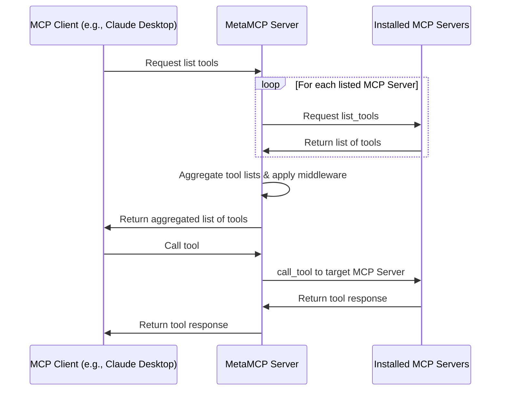
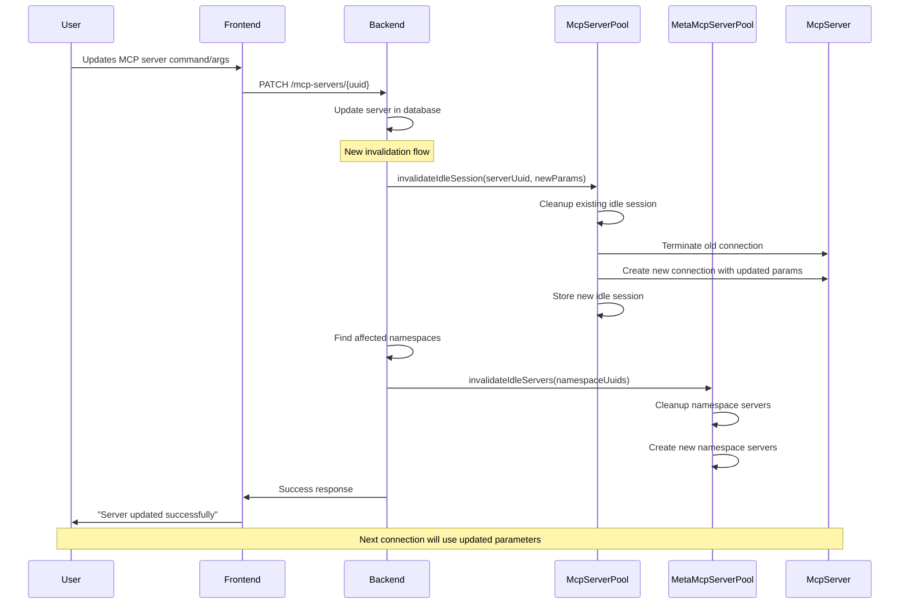

## Architecture Overview (WIP)

### Main

```mermaid
sequenceDiagram
    participant MCPClient as MCP Client (e.g., Claude Desktop)
    participant MetaMCP as MetaMCP Server
    participant MCPServers as Installed MCP Servers

    MCPClient ->> MetaMCP: Request list tools

    loop For each listed MCP Server
        MetaMCP ->> MCPServers: Request list_tools
        MCPServers ->> MetaMCP: Return list of tools
    end

    MetaMCP ->> MetaMCP: Aggregate tool lists & apply middleware
    MetaMCP ->> MCPClient: Return aggregated list of tools

    MCPClient ->> MetaMCP: Call tool
    MetaMCP ->> MCPServers: call_tool to target MCP Server
    MCPServers ->> MetaMCP: Return tool response
    MetaMCP ->> MCPClient: Return tool response
```

### Idle Session invalidation

```mermaid
sequenceDiagram
    participant User
    participant Frontend
    participant Backend
    participant McpServerPool
    participant MetaMcpServerPool
    participant McpServer

    User->>Frontend: Updates MCP server command/args
    Frontend->>Backend: PATCH /mcp-servers/{uuid}
    Backend->>Backend: Update server in database
    
    Note over Backend: New invalidation flow
    Backend->>McpServerPool: invalidateIdleSession(serverUuid, newParams)
    McpServerPool->>McpServerPool: Cleanup existing idle session
    McpServerPool->>McpServer: Terminate old connection
    McpServerPool->>McpServer: Create new connection with updated params
    McpServerPool->>McpServerPool: Store new idle session
    
    Backend->>Backend: Find affected namespaces
    Backend->>MetaMcpServerPool: invalidateIdleServers(namespaceUuids)
    MetaMcpServerPool->>MetaMcpServerPool: Cleanup namespace servers
    MetaMcpServerPool->>MetaMcpServerPool: Create new namespace servers
    
    Backend->>Frontend: Success response
    Frontend->>User: "Server updated successfully"
    
    Note over User,McpServer: Next connection will use updated parameters
```