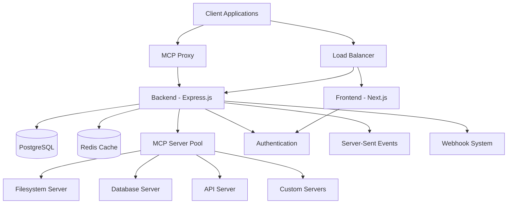
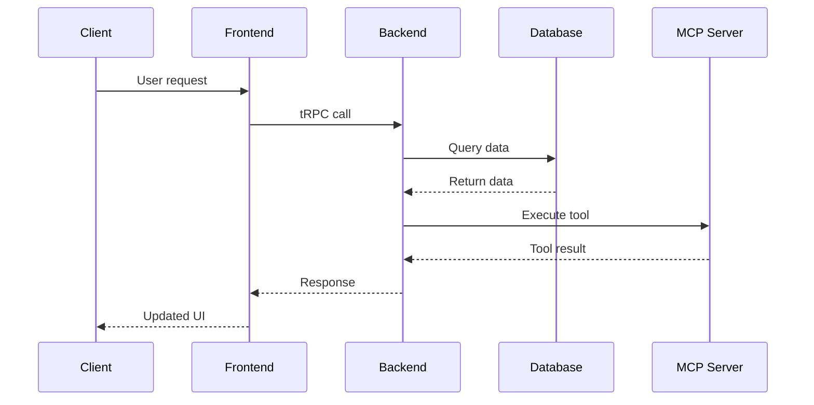
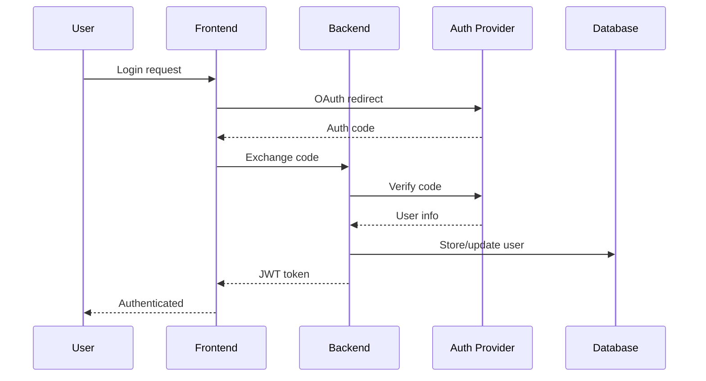

# Architecture Overview

Comprehensive guide to MetaMCP's system architecture and design patterns.

## System Overview

MetaMCP is a distributed system designed to manage and proxy Model Context Protocol (MCP) servers with enterprise-grade features.



## Core Components

### Frontend (Next.js)

**Location**: `apps/frontend/`

**Responsibilities**:
- User interface and experience
- Authentication flows
- Real-time dashboard updates
- Server and namespace management
- Tool execution monitoring

**Key Technologies**:
- Next.js 14 with App Router
- TypeScript
- Tailwind CSS
- tRPC client
- React Query for data fetching
- Zustand for state management

**Architecture Patterns**:
```typescript
// Component structure
apps/frontend/
├── app/                    # App Router pages
├── components/             # Reusable UI components
│   ├── ui/                # Base UI components
│   ├── domain-specific/   # Business logic components
│   └── providers/         # Context providers
├── hooks/                 # Custom React hooks
├── lib/                   # Utility libraries
└── types/                 # TypeScript type definitions
```

### Backend (Express.js)

**Location**: `apps/backend/`

**Responsibilities**:
- API endpoints and business logic
- Authentication and authorization
- MCP server management
- Tool execution orchestration
- Real-time communication
- Database operations

**Key Technologies**:
- Express.js with TypeScript
- tRPC for type-safe APIs
- Drizzle ORM for database access
- BetterAuth for authentication
- Server-Sent Events for real-time updates
- Bull/Bullmq for background jobs

**Architecture Patterns**:
```typescript
// Backend structure
apps/backend/src/
├── routers/               # tRPC routers
├── trpc/                  # tRPC implementations
├── middleware/            # Express middleware
├── lib/                   # Core business logic
│   ├── metamcp/          # MCP proxy system
│   └── services/         # Business services
├── db/                   # Database layer
│   ├── repositories/     # Data access layer
│   ├── serializers/      # Data transformation
│   └── schema.ts         # Database schema
└── index.ts              # Application entry point
```

## Data Architecture

### Database Schema

MetaMCP uses PostgreSQL with Drizzle ORM for type-safe database operations.

```sql
-- Core entities
CREATE TABLE users (
    id UUID PRIMARY KEY,
    email VARCHAR NOT NULL UNIQUE,
    name VARCHAR,
    role VARCHAR DEFAULT 'user',
    created_at TIMESTAMP DEFAULT NOW()
);

CREATE TABLE namespaces (
    id UUID PRIMARY KEY,
    name VARCHAR NOT NULL,
    description TEXT,
    user_id UUID REFERENCES users(id),
    created_at TIMESTAMP DEFAULT NOW()
);

CREATE TABLE mcp_servers (
    id UUID PRIMARY KEY,
    name VARCHAR NOT NULL,
    command VARCHAR NOT NULL,
    args JSONB,
    env JSONB,
    namespace_id UUID REFERENCES namespaces(id),
    status VARCHAR DEFAULT 'stopped',
    created_at TIMESTAMP DEFAULT NOW()
);

CREATE TABLE tools (
    id UUID PRIMARY KEY,
    name VARCHAR NOT NULL,
    description TEXT,
    input_schema JSONB,
    mcp_server_id UUID REFERENCES mcp_servers(id),
    namespace_id UUID REFERENCES namespaces(id)
);

CREATE TABLE api_keys (
    id UUID PRIMARY KEY,
    name VARCHAR NOT NULL,
    key_hash VARCHAR NOT NULL,
    permissions JSONB,
    user_id UUID REFERENCES users(id),
    expires_at TIMESTAMP,
    created_at TIMESTAMP DEFAULT NOW()
);
```

### Data Flow



## MCP Proxy System

### Architecture

The MCP Proxy is the core component that manages communication with MCP servers.

```typescript
// Core proxy architecture
class MetaMCPProxy {
  private serverPool: MCPServerPool;
  private middleware: MiddlewareChain;
  private logStore: LogStore;
  
  async executeQuery(request: MCPRequest): Promise<MCPResponse> {
    // Apply middleware
    const processedRequest = await this.middleware.process(request);
    
    // Route to appropriate server
    const server = await this.serverPool.getServer(processedRequest.namespace);
    
    // Execute and log
    const result = await server.execute(processedRequest);
    await this.logStore.record(request, result);
    
    return result;
  }
}
```

### Server Pool Management

```typescript
// Server lifecycle management
class MCPServerPool {
  private servers = new Map<string, MCPServerInstance>();
  private healthChecker: HealthChecker;
  
  async getServer(namespaceId: string): Promise<MCPServerInstance> {
    let server = this.servers.get(namespaceId);
    
    if (!server || !server.isHealthy()) {
      server = await this.createServer(namespaceId);
      this.servers.set(namespaceId, server);
    }
    
    return server;
  }
  
  private async createServer(namespaceId: string): Promise<MCPServerInstance> {
    const config = await this.getServerConfig(namespaceId);
    const server = new MCPServerInstance(config);
    await server.start();
    return server;
  }
}
```

### Middleware System

```typescript
// Functional middleware pattern
type MiddlewareFunction = (
  request: MCPRequest,
  next: (req: MCPRequest) => Promise<MCPResponse>
) => Promise<MCPResponse>;

// Example middleware
const authMiddleware: MiddlewareFunction = async (request, next) => {
  const user = await authenticateRequest(request);
  if (!user) {
    throw new UnauthorizedError();
  }
  
  request.user = user;
  return next(request);
};

const rateLimitMiddleware: MiddlewareFunction = async (request, next) => {
  await checkRateLimit(request.user.id);
  return next(request);
};

// Middleware composition
const middlewareChain = compose([
  authMiddleware,
  rateLimitMiddleware,
  loggingMiddleware,
  toolFilterMiddleware
]);
```

## Authentication & Authorization

### Authentication Flow



### Authorization Model

```typescript
// Role-based access control
enum Role {
  ADMIN = 'admin',
  USER = 'user',
  VIEWER = 'viewer'
}

enum Permission {
  MCP_SERVERS_READ = 'mcp-servers:read',
  MCP_SERVERS_WRITE = 'mcp-servers:write',
  TOOLS_EXECUTE = 'tools:execute',
  ADMIN_ALL = 'admin:all'
}

// Permission checking
class AuthorizationService {
  async hasPermission(
    user: User, 
    permission: Permission, 
    resource?: Resource
  ): Promise<boolean> {
    // Role-based permissions
    if (user.role === Role.ADMIN) return true;
    
    // Explicit permissions
    if (user.permissions.includes(permission)) {
      return this.checkResourceAccess(user, resource);
    }
    
    return false;
  }
  
  private async checkResourceAccess(
    user: User, 
    resource?: Resource
  ): Promise<boolean> {
    if (!resource) return true;
    
    // Check namespace ownership
    if (resource.type === 'namespace') {
      return resource.userId === user.id;
    }
    
    // Check through namespace relationship
    const namespace = await this.getResourceNamespace(resource);
    return namespace.userId === user.id;
  }
}
```

## Real-time Communication

### Server-Sent Events

```typescript
// SSE implementation for real-time updates
class SSEService {
  private connections = new Map<string, Response>();
  
  addConnection(userId: string, response: Response) {
    this.connections.set(userId, response);
    
    // Setup heartbeat
    const heartbeat = setInterval(() => {
      this.send(userId, { type: 'heartbeat', timestamp: Date.now() });
    }, 30000);
    
    // Cleanup on disconnect
    response.on('close', () => {
      clearInterval(heartbeat);
      this.connections.delete(userId);
    });
  }
  
  send(userId: string, data: any) {
    const connection = this.connections.get(userId);
    if (connection) {
      connection.write(`data: ${JSON.stringify(data)}\n\n`);
    }
  }
  
  broadcast(data: any) {
    for (const connection of this.connections.values()) {
      connection.write(`data: ${JSON.stringify(data)}\n\n`);
    }
  }
}
```

### WebSocket Alternative

For more complex real-time needs:

```typescript
// WebSocket service for bidirectional communication
class WebSocketService {
  private wss: WebSocketServer;
  private clients = new Map<string, WebSocket>();
  
  constructor() {
    this.wss = new WebSocketServer({ port: 8080 });
    this.setupEventHandlers();
  }
  
  private setupEventHandlers() {
    this.wss.on('connection', (ws, request) => {
      const userId = this.authenticateConnection(request);
      this.clients.set(userId, ws);
      
      ws.on('message', (data) => {
        this.handleMessage(userId, JSON.parse(data.toString()));
      });
      
      ws.on('close', () => {
        this.clients.delete(userId);
      });
    });
  }
}
```

## Performance & Scalability

### Caching Strategy

```typescript
// Multi-layer caching
class CacheService {
  private l1Cache: Map<string, any> = new Map(); // In-memory
  private l2Cache: Redis; // Redis
  private l3Cache: Database; // Database
  
  async get<T>(key: string): Promise<T | null> {
    // L1: Memory cache
    let value = this.l1Cache.get(key);
    if (value) return value;
    
    // L2: Redis cache
    value = await this.l2Cache.get(key);
    if (value) {
      this.l1Cache.set(key, value);
      return JSON.parse(value);
    }
    
    // L3: Database
    value = await this.l3Cache.get(key);
    if (value) {
      await this.l2Cache.setex(key, 3600, JSON.stringify(value));
      this.l1Cache.set(key, value);
      return value;
    }
    
    return null;
  }
}
```

### Connection Pooling

```typescript
// MCP server connection pooling
class ConnectionPool {
  private pools = new Map<string, Pool<MCPConnection>>();
  
  async getConnection(serverId: string): Promise<MCPConnection> {
    let pool = this.pools.get(serverId);
    
    if (!pool) {
      pool = new Pool({
        create: () => this.createConnection(serverId),
        destroy: (conn) => conn.close(),
        max: 10,
        min: 2,
        idleTimeoutMillis: 30000
      });
      this.pools.set(serverId, pool);
    }
    
    return pool.acquire();
  }
  
  releaseConnection(serverId: string, connection: MCPConnection) {
    const pool = this.pools.get(serverId);
    if (pool) {
      pool.release(connection);
    }
  }
}
```

## Error Handling & Resilience

### Circuit Breaker Pattern

```typescript
// Circuit breaker for MCP servers
class CircuitBreaker {
  private failures = 0;
  private lastFailTime = 0;
  private state: 'CLOSED' | 'OPEN' | 'HALF_OPEN' = 'CLOSED';
  
  async execute<T>(operation: () => Promise<T>): Promise<T> {
    if (this.state === 'OPEN') {
      if (Date.now() - this.lastFailTime > this.timeout) {
        this.state = 'HALF_OPEN';
      } else {
        throw new CircuitBreakerOpenError();
      }
    }
    
    try {
      const result = await operation();
      this.onSuccess();
      return result;
    } catch (error) {
      this.onFailure();
      throw error;
    }
  }
  
  private onSuccess() {
    this.failures = 0;
    this.state = 'CLOSED';
  }
  
  private onFailure() {
    this.failures++;
    this.lastFailTime = Date.now();
    
    if (this.failures >= this.threshold) {
      this.state = 'OPEN';
    }
  }
}
```

### Retry Strategy

```typescript
// Exponential backoff retry
class RetryService {
  async withRetry<T>(
    operation: () => Promise<T>,
    options: RetryOptions = {}
  ): Promise<T> {
    const { maxRetries = 3, baseDelay = 1000, maxDelay = 10000 } = options;
    
    for (let attempt = 0; attempt <= maxRetries; attempt++) {
      try {
        return await operation();
      } catch (error) {
        if (attempt === maxRetries || !this.isRetryable(error)) {
          throw error;
        }
        
        const delay = Math.min(
          baseDelay * Math.pow(2, attempt),
          maxDelay
        );
        
        await this.sleep(delay);
      }
    }
  }
  
  private isRetryable(error: Error): boolean {
    return (
      error instanceof NetworkError ||
      error instanceof TimeoutError ||
      (error instanceof HTTPError && error.status >= 500)
    );
  }
}
```

## Monitoring & Observability

### Logging Strategy

```typescript
// Structured logging
class Logger {
  private context: Record<string, any> = {};
  
  child(context: Record<string, any>): Logger {
    const child = new Logger();
    child.context = { ...this.context, ...context };
    return child;
  }
  
  info(message: string, data?: Record<string, any>) {
    this.log('info', message, data);
  }
  
  error(message: string, error?: Error, data?: Record<string, any>) {
    this.log('error', message, { 
      ...data, 
      error: error?.message,
      stack: error?.stack
    });
  }
  
  private log(level: string, message: string, data?: Record<string, any>) {
    const logEntry = {
      timestamp: new Date().toISOString(),
      level,
      message,
      context: this.context,
      ...data
    };
    
    console.log(JSON.stringify(logEntry));
  }
}
```

### Metrics Collection

```typescript
// Prometheus metrics
class MetricsService {
  private registry = new prometheus.Registry();
  private httpRequestDuration: prometheus.Histogram;
  private toolExecutionCount: prometheus.Counter;
  
  constructor() {
    this.httpRequestDuration = new prometheus.Histogram({
      name: 'http_request_duration_seconds',
      help: 'Duration of HTTP requests in seconds',
      labelNames: ['method', 'route', 'status_code'],
      buckets: [0.1, 0.5, 1, 2, 5]
    });
    
    this.toolExecutionCount = new prometheus.Counter({
      name: 'tool_executions_total',
      help: 'Total number of tool executions',
      labelNames: ['tool_name', 'namespace', 'status']
    });
    
    this.registry.registerMetric(this.httpRequestDuration);
    this.registry.registerMetric(this.toolExecutionCount);
  }
  
  recordHttpRequest(method: string, route: string, statusCode: number, duration: number) {
    this.httpRequestDuration
      .labels(method, route, statusCode.toString())
      .observe(duration);
  }
  
  recordToolExecution(toolName: string, namespace: string, status: string) {
    this.toolExecutionCount
      .labels(toolName, namespace, status)
      .inc();
  }
}
```

## Deployment Architecture

### Container Strategy

```dockerfile
# Multi-stage build for optimal image size
FROM node:18-alpine AS base
WORKDIR /app
COPY package*.json ./
RUN npm ci --only=production

FROM node:18-alpine AS build
WORKDIR /app
COPY . .
RUN npm ci
RUN npm run build

FROM node:18-alpine AS runtime
WORKDIR /app
COPY --from=base /app/node_modules ./node_modules
COPY --from=build /app/dist ./dist
COPY package*.json ./

EXPOSE 8000
CMD ["npm", "start"]
```

### Kubernetes Deployment

```yaml
# Deployment configuration
apiVersion: apps/v1
kind: Deployment
metadata:
  name: metamcp-backend
spec:
  replicas: 3
  selector:
    matchLabels:
      app: metamcp-backend
  template:
    metadata:
      labels:
        app: metamcp-backend
    spec:
      containers:
      - name: backend
        image: metamcp/backend:latest
        ports:
        - containerPort: 8000
        env:
        - name: DATABASE_URL
          valueFrom:
            secretKeyRef:
              name: metamcp-secrets
              key: database-url
        livenessProbe:
          httpGet:
            path: /api/health
            port: 8000
          initialDelaySeconds: 30
          periodSeconds: 10
        readinessProbe:
          httpGet:
            path: /api/ready
            port: 8000
          initialDelaySeconds: 5
          periodSeconds: 5
```

## Security Architecture

### Input Validation

```typescript
// Zod-based validation
const toolExecutionSchema = z.object({
  name: z.string().min(1).max(100),
  arguments: z.record(z.any()),
  namespace: z.string().uuid(),
  timeout: z.number().positive().max(300).optional()
});

// Validation middleware
const validateInput = (schema: z.ZodSchema) => {
  return (req: Request, res: Response, next: NextFunction) => {
    try {
      schema.parse(req.body);
      next();
    } catch (error) {
      res.status(400).json({ error: 'Invalid input', details: error });
    }
  };
};
```

### Rate Limiting

```typescript
// Token bucket rate limiter
class RateLimiter {
  private buckets = new Map<string, TokenBucket>();
  
  async checkLimit(key: string, limit: number, window: number): Promise<boolean> {
    let bucket = this.buckets.get(key);
    
    if (!bucket) {
      bucket = new TokenBucket(limit, window);
      this.buckets.set(key, bucket);
    }
    
    return bucket.consume();
  }
}

class TokenBucket {
  private tokens: number;
  private lastRefill: number;
  
  constructor(private capacity: number, private refillRate: number) {
    this.tokens = capacity;
    this.lastRefill = Date.now();
  }
  
  consume(): boolean {
    this.refill();
    
    if (this.tokens > 0) {
      this.tokens--;
      return true;
    }
    
    return false;
  }
  
  private refill() {
    const now = Date.now();
    const elapsed = (now - this.lastRefill) / 1000;
    const tokensToAdd = elapsed * this.refillRate;
    
    this.tokens = Math.min(this.capacity, this.tokens + tokensToAdd);
    this.lastRefill = now;
  }
}
```

## Testing Architecture

### Test Strategy

```typescript
// Unit tests
describe('MCPProxy', () => {
  let proxy: MCPProxy;
  let mockServerPool: jest.Mocked<MCPServerPool>;
  
  beforeEach(() => {
    mockServerPool = createMockServerPool();
    proxy = new MCPProxy(mockServerPool);
  });
  
  it('should execute tool successfully', async () => {
    const request = createMockRequest();
    const expectedResponse = createMockResponse();
    
    mockServerPool.getServer.mockResolvedValue(
      createMockServer(expectedResponse)
    );
    
    const result = await proxy.executeQuery(request);
    
    expect(result).toEqual(expectedResponse);
    expect(mockServerPool.getServer).toHaveBeenCalledWith(request.namespace);
  });
});

// Integration tests
describe('Tool Execution API', () => {
  let app: Express;
  let testDb: Database;
  
  beforeAll(async () => {
    testDb = await createTestDatabase();
    app = createApp({ database: testDb });
  });
  
  afterAll(async () => {
    await testDb.cleanup();
  });
  
  it('should execute tool with valid request', async () => {
    const response = await request(app)
      .post('/api/namespaces/test-namespace/tools/execute')
      .set('Authorization', 'Bearer test-api-key')
      .send({
        name: 'test_tool',
        arguments: { param: 'value' }
      });
    
    expect(response.status).toBe(200);
    expect(response.body).toHaveProperty('result');
  });
});
```

This architecture ensures MetaMCP is scalable, maintainable, and resilient while providing a great developer experience. 