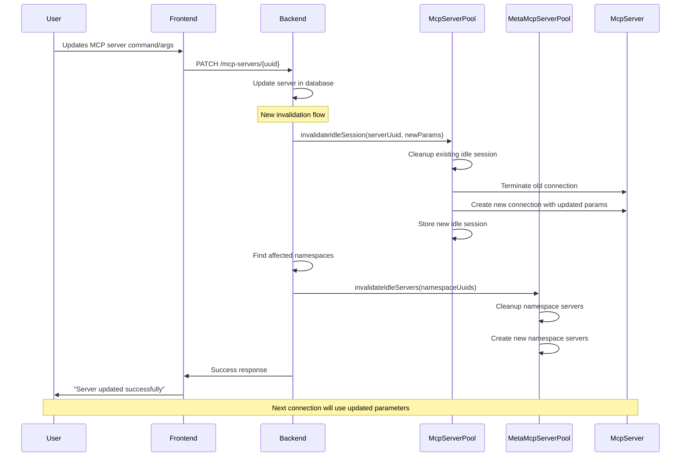

```mermaid
sequenceDiagram
    participant User
    participant Frontend
    participant Backend
    participant McpServerPool
    participant MetaMcpServerPool
    participant McpServer

    User->>Frontend: Updates MCP server command/args
    Frontend->>Backend: PATCH /mcp-servers/{uuid}
    Backend->>Backend: Update server in database
    
    Note over Backend: New invalidation flow
    Backend->>McpServerPool: invalidateIdleSession(serverUuid, newParams)
    McpServerPool->>McpServerPool: Cleanup existing idle session
    McpServerPool->>McpServer: Terminate old connection
    McpServerPool->>McpServer: Create new connection with updated params
    McpServerPool->>McpServerPool: Store new idle session
    
    Backend->>Backend: Find affected namespaces
    Backend->>MetaMcpServerPool: invalidateIdleServers(namespaceUuids)
    MetaMcpServerPool->>MetaMcpServerPool: Cleanup namespace servers
    MetaMcpServerPool->>MetaMcpServerPool: Create new namespace servers
    
    Backend->>Frontend: Success response
    Frontend->>User: "Server updated successfully"
    
    Note over User,McpServer: Next connection will use updated parameters
```